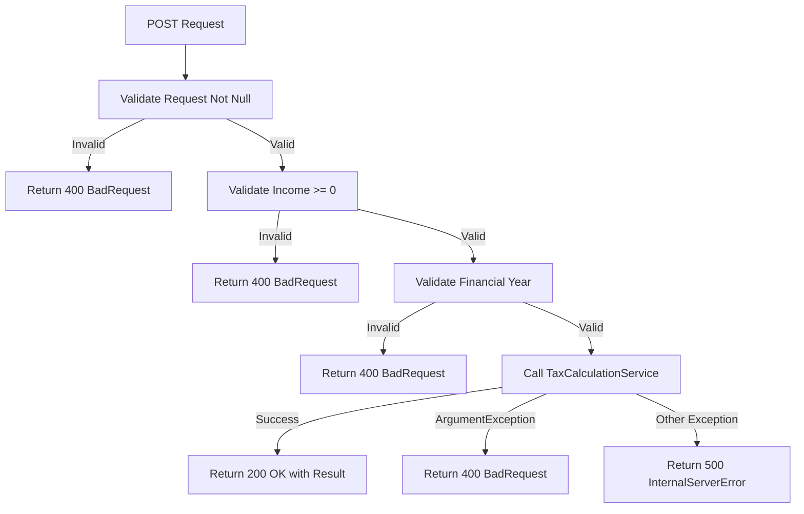
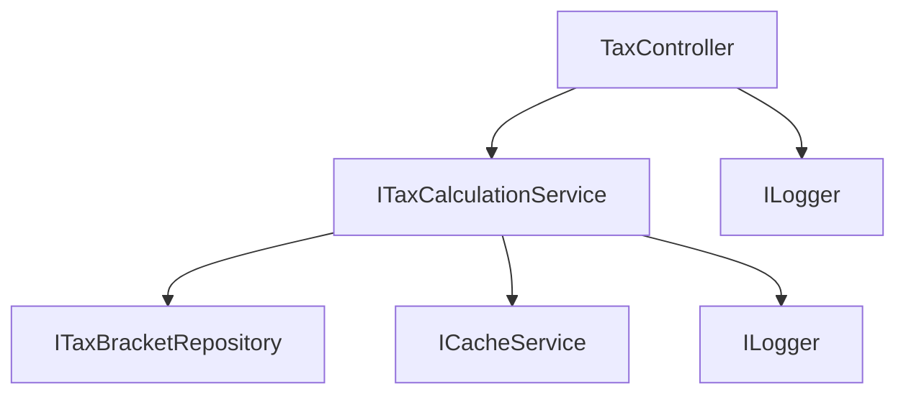

# API Business Logic Analysis

## Overview
Analysis of business logic and validation rules implemented in the API layer of the Australian Tax Calculator system.

---

## Tax Controller Business Logic

### Primary Controller: TaxController

**File**: `TaxController.cs`  
**Namespace**: `TaxCalculator.Api.Controllers`  
**Routes**: `/api/tax/*`  
**Purpose**: Expose tax calculation functionality via REST API

---

## Endpoint Analysis

### 1. Calculate Tax Endpoint

**Route**: `POST /api/tax/calculate`  
**Method**: `CalculateTax`  
**Lines**: 24-50  
**Classification**: CORE_BUSINESS

#### Request Validation Business Rules

```csharp
// Rule: Request object cannot be null
if (request == null)
    return BadRequest("Request cannot be null");

// Rule: Taxable income must be non-negative
if (request.TaxableIncome < 0)
    return BadRequest("Taxable income cannot be negative");

// Rule: Financial year is mandatory
if (string.IsNullOrEmpty(request.FinancialYear))
    return BadRequest("Financial year is required");
```

#### Business Logic Flow



#### Error Handling Logic

1. **Validation Errors** → HTTP 400 Bad Request
2. **ArgumentException** → HTTP 400 Bad Request + Logging
3. **General Exceptions** → HTTP 500 Internal Server Error + Logging

#### Business Impact
- **Data Integrity**: Prevents invalid calculations
- **User Experience**: Clear error messages
- **System Reliability**: Graceful error handling

---

### 2. Get Tax Brackets Endpoint

**Route**: `GET /api/tax/brackets/{year}`  
**Method**: `GetTaxBrackets`  
**Lines**: 52-69  
**Classification**: DATA_RETRIEVAL

#### Validation Rules

```csharp
if (string.IsNullOrEmpty(year))
    return BadRequest("Year is required");
```

#### Business Logic

1. **Input Validation**: Year parameter must be provided
2. **Service Delegation**: Calls `TaxCalculationService.GetTaxBracketsAsync()`
3. **Error Handling**: Generic exception handling with logging

#### API Response Format

```json
[
  {
    "BracketOrder": 1,
    "MinIncome": 0,
    "MaxIncome": 18200,
    "TaxRate": 0,
    "FixedAmount": 0,
    "FinancialYear": "2023-24"
  }
]
```

---

### 3. Compare Tax Across Years Endpoint

**Route**: `GET /api/tax/compare?income={income}&years={years[]}`  
**Method**: `CompareTax`  
**Lines**: 71-91  
**Classification**: ANALYTICAL

#### Validation Business Rules

```csharp
// Rule: Income must be non-negative
if (income < 0)
    return BadRequest("Income cannot be negative");

// Rule: At least one year must be provided
if (years == null || years.Length == 0)
    return BadRequest("Years are required");
```

#### Business Logic

1. **Multi-Parameter Validation**: Income and years array
2. **Array Processing**: Converts string array to List<string>
3. **Future Enhancement**: Currently throws NotImplementedException

#### Implementation Status
**Status**: Planned (NotImplementedException)  
**Purpose**: Compare tax liability across multiple financial years

---

### 4. Get Tax History Endpoint

**Route**: `GET /api/tax/history/{income}?years={years}`  
**Method**: `GetTaxHistory`  
**Lines**: 93-113  
**Classification**: ANALYTICAL

#### Validation Business Rules

```csharp
// Rule: Income must be non-negative
if (income < 0)
    return BadRequest("Income cannot be negative");

// Rule: Years must be between 1 and 20
if (years <= 0 || years > 20)
    return BadRequest("Years must be between 1 and 20");
```

#### Business Constraints

- **Minimum Years**: 1
- **Maximum Years**: 20
- **Default Years**: 10
- **Income Constraint**: Must be >= 0

#### Implementation Status
**Status**: Planned (NotImplementedException)  
**Purpose**: Historical tax calculation for given income

---

## Health Controller Business Logic

### Health Check Endpoint

**File**: `HealthController.cs`  
**Route**: `GET /api/health`  
**Purpose**: System health monitoring

#### Basic Implementation
```csharp
[HttpGet]
public IHttpActionResult Get()
{
    return Ok(new { Status = "Healthy", Timestamp = DateTime.UtcNow });
}
```

**Classification**: INFRASTRUCTURE  
**Business Impact**: System monitoring and availability

---

## Standalone API Server

### TaxApiServer Business Logic

**File**: `TaxApiServer.cs`  
**Lines**: Multiple  
**Classification**: INFRASTRUCTURE

#### Self-Hosted API Implementation

Key business logic:
1. **Service Configuration**: Sets up dependency injection
2. **Endpoint Registration**: Configures API routes
3. **Error Handling**: Global exception handling
4. **CORS Configuration**: Cross-origin request handling

---

## API Validation Patterns

### Input Validation Strategy

```csharp
// Pattern 1: Null Checks
if (request == null)
    return BadRequest("Request cannot be null");

// Pattern 2: Range Validation
if (request.TaxableIncome < 0)
    return BadRequest("Taxable income cannot be negative");

// Pattern 3: Required Field Validation
if (string.IsNullOrEmpty(request.FinancialYear))
    return BadRequest("Financial year is required");

// Pattern 4: Collection Validation
if (years == null || years.Length == 0)
    return BadRequest("Years are required");

// Pattern 5: Range Constraints
if (years <= 0 || years > 20)
    return BadRequest("Years must be between 1 and 20");
```

### Business Rule Categories

| Rule Type | Examples | Purpose |
|-----------|----------|---------|
| **Null Validation** | Request, Year parameters | Data integrity |
| **Range Validation** | Income >= 0, Years 1-20 | Business constraints |
| **Required Fields** | Financial year, Years array | Complete data |
| **Format Validation** | String emptiness checks | Data quality |

---

## Error Handling Business Logic

### Exception Handling Strategy

```csharp
try
{
    // Business operation
    var result = await _taxCalculationService.CalculateTaxAsync(request);
    return Ok(result);
}
catch (ArgumentException ex)
{
    // Business rule violations
    _logger.LogWarning($"Invalid request: {ex.Message}");
    return BadRequest(ex.Message);
}
catch (Exception ex)
{
    // System errors
    _logger.LogError($"Error calculating tax: {ex.Message}", ex);
    return InternalServerError(ex);
}
```

#### Error Categories

1. **Business Rule Violations** (ArgumentException)
   - Return: HTTP 400 Bad Request
   - Logging: Warning level
   - Message: Specific validation error

2. **System Errors** (General Exception)
   - Return: HTTP 500 Internal Server Error
   - Logging: Error level with stack trace
   - Message: Generic error response

3. **Validation Errors** (Direct validation)
   - Return: HTTP 400 Bad Request
   - Logging: Warning level
   - Message: Descriptive validation message

---

## Request/Response Business Models

### Tax Calculation Request

```csharp
public class TaxCalculationRequest
{
    public decimal TaxableIncome { get; set; }      // Must be >= 0
    public string FinancialYear { get; set; }       // Required, format: "YYYY-YY"
    public string ResidencyStatus { get; set; }     // Default: "Resident"
    public bool IncludeMedicareLevy { get; set; }   // Default: true
    public bool IncludeOffsets { get; set; }        // Default: true
}
```

**Business Validation Rules**:
- TaxableIncome: Non-negative decimal
- FinancialYear: Required string, specific format
- ResidencyStatus: Affects tax calculation rules
- Boolean flags: Control calculation components

### Tax Calculation Response

```csharp
public class TaxCalculationResult
{
    public decimal TaxableIncome { get; set; }
    public decimal IncomeTax { get; set; }
    public decimal MedicareLevy { get; set; }
    public decimal BudgetRepairLevy { get; set; }
    public decimal TotalLevies { get; set; }
    public decimal TaxOffsets { get; set; }
    public decimal NetTaxPayable { get; set; }
    public decimal NetIncome { get; set; }
    public decimal EffectiveRate { get; set; }
    public decimal MarginalRate { get; set; }
    public List<TaxBracketCalculation> BracketBreakdown { get; set; }
}
```

**Business Data**:
- Comprehensive tax breakdown
- Multiple levy types
- Effective and marginal rates
- Detailed bracket calculations

---

## API Business Constraints

### Performance Constraints

1. **Response Time**: Calculations should complete within 2 seconds
2. **Caching**: Tax brackets cached for 24 hours
3. **Concurrent Users**: Support multiple simultaneous calculations

### Data Constraints

1. **Income Limits**: No upper limit on taxable income
2. **Year Range**: Historical data availability dependent on database
3. **Request Size**: Standard HTTP request limits

### Security Constraints

1. **Input Sanitization**: All inputs validated before processing
2. **Error Disclosure**: No sensitive information in error messages
3. **Logging**: All operations logged for audit trails

---

## Business Logic Dependencies

### Service Dependencies



### External Dependencies

1. **Database**: Tax brackets, levies, offsets by year
2. **Cache**: Performance optimization for frequent calculations
3. **Logging**: Audit trail and error tracking

---

## API Contract Business Rules

### Versioning Strategy

- **Current**: No explicit versioning
- **Future**: Consider versioning for breaking changes
- **Backward Compatibility**: Maintain existing endpoints

### Data Format Standards

1. **Decimal Precision**: Financial calculations require precision
2. **Date Formats**: Financial year as string (e.g., "2023-24")
3. **Currency**: All amounts in Australian dollars
4. **Rates**: Decimal format (e.g., 0.325 for 32.5%)

---

## Testing Requirements

### API Endpoint Testing

1. **Validation Testing**:
   - Null request handling
   - Negative income validation
   - Missing parameter handling
   - Range constraint testing

2. **Business Logic Testing**:
   - Tax calculation accuracy
   - Error scenario handling
   - Edge case behavior

3. **Integration Testing**:
   - End-to-end API workflows
   - Database integration
   - Cache behavior

### Test Data Requirements

1. **Valid Scenarios**:
   - Various income levels
   - Different financial years
   - Multiple tax brackets

2. **Invalid Scenarios**:
   - Negative incomes
   - Null requests
   - Missing parameters
   - Invalid years

---

## Migration Impact Assessment

### API Compatibility

1. **Endpoint URLs**: Maintain existing routes
2. **Request/Response Format**: Preserve existing contracts
3. **Validation Rules**: Keep business rule consistency
4. **Error Handling**: Maintain error response patterns

### Framework Upgrade Considerations

1. **ASP.NET Web API 2** → **ASP.NET Core**
2. **Controller Inheritance**: Change from ApiController to ControllerBase
3. **Action Results**: Update to modern IActionResult patterns
4. **Dependency Injection**: Migrate from Autofac to built-in DI

### Recommended Approach

1. **Preserve Business Logic**: Keep validation and business rules identical
2. **Update Framework Patterns**: Modernize to ASP.NET Core conventions
3. **Maintain API Contracts**: Ensure backward compatibility
4. **Enhance Logging**: Implement structured logging patterns
