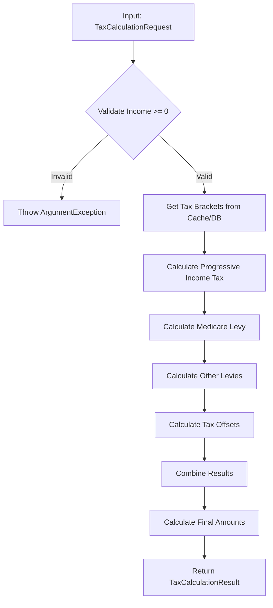
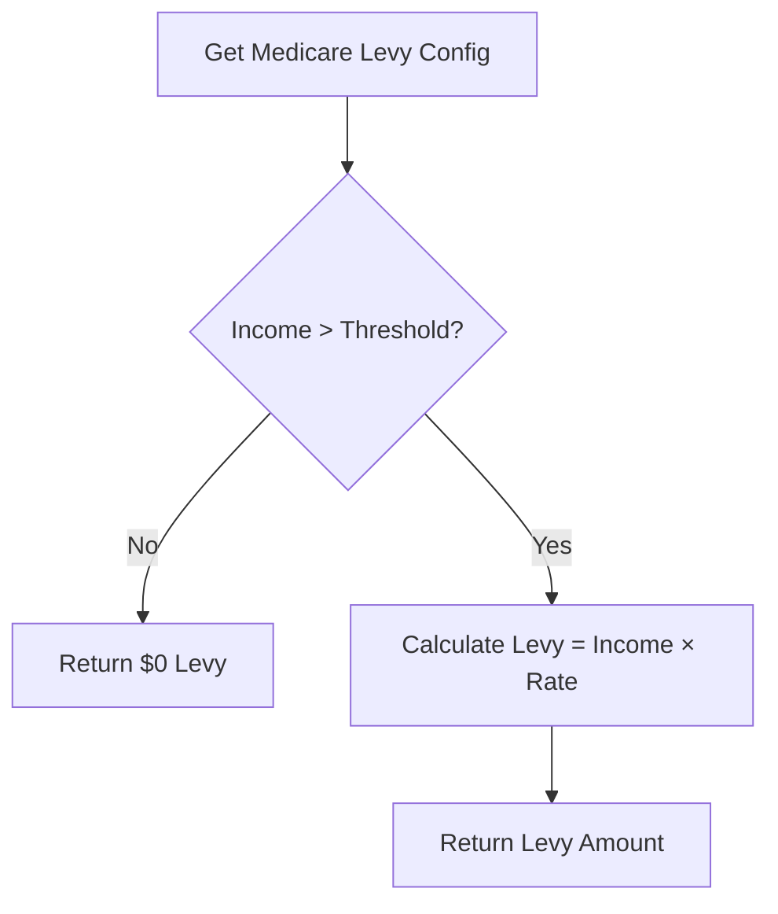
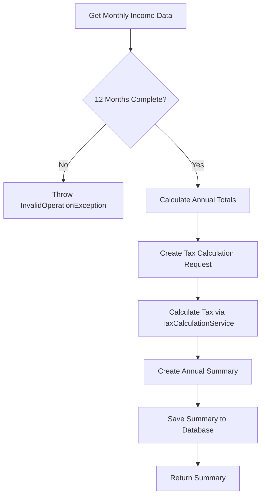

# Tax Calculation Business Logic Analysis

## Overview
Detailed analysis of core tax calculation business logic extracted from the TaxCalculationService and related components.

---

## Core Tax Calculation Engine

### Primary Method: CalculateTaxAsync

**File**: `TaxCalculationService.cs`  
**Lines**: 27-76  
**Classification**: CORE_BUSINESS  
**Complexity**: HIGH

#### Business Logic Flow



#### Key Business Rules Implemented

1. **Income Validation Rule**
   - **Location**: Line 29-30
   - **Logic**: `if (request.TaxableIncome < 0) throw new ArgumentException`
   - **Business Impact**: Prevents invalid calculations

2. **Caching Strategy**
   - **Location**: Lines 34-42
   - **Logic**: 24-hour cache for tax brackets by financial year
   - **Business Impact**: Performance optimization

3. **Net Tax Calculation**
   - **Location**: Line 70
   - **Formula**: `Math.Max(0, grossTax - result.TaxOffsets)`
   - **Business Impact**: Ensures non-negative tax liability

4. **Effective Rate Calculation**
   - **Location**: Line 72
   - **Formula**: `result.TaxableIncome > 0 ? result.NetTaxPayable / result.TaxableIncome : 0`
   - **Business Impact**: Taxpayer transparency

---

## Progressive Income Tax Engine

### Method: CalculateProgressiveIncomeTax

**File**: `TaxCalculationService.cs`  
**Lines**: 78-122  
**Classification**: CORE_BUSINESS  
**Complexity**: HIGH

#### Algorithm Implementation

```csharp
// Simplified algorithm
foreach (var bracket in brackets.OrderBy(b => b.BracketOrder))
{
    if (remainingIncome <= 0) break;
    if (income <= bracketMin) continue;
    
    decimal taxableInBracket = CalculateTaxableInBracket(income, bracket);
    decimal taxInBracket = bracket.FixedAmount + (taxableInBracket * bracket.TaxRate);
    
    totalTax += taxInBracket;
    remainingIncome -= taxableInBracket;
}
```

#### Business Rules

1. **Bracket Order Processing**
   - **Logic**: Process brackets in ascending order
   - **Implementation**: `brackets.OrderBy(b => b.BracketOrder)`
   - **Requirement**: Australian progressive tax structure

2. **Taxable Income Calculation**
   - **Formula**: 
     ```csharp
     if (income > bracketMax)
         taxableInBracket = bracketMax - bracketMin + 1;
     else
         taxableInBracket = income - bracketMin + 1;
     ```
   - **Business Impact**: Correct progressive taxation

3. **Tax Per Bracket Formula**
   - **Formula**: `bracket.FixedAmount + (taxableInBracket * bracket.TaxRate)`
   - **Components**: Fixed amount + proportional amount
   - **Compliance**: ATO tax bracket structure

#### Example Calculation
For $75,000 taxable income in 2023-24:

| Bracket | Range | Rate | Taxable | Fixed | Tax |
|---------|-------|------|---------|-------|-----|
| 1 | $0 - $18,200 | 0% | $18,200 | $0 | $0 |
| 2 | $18,201 - $45,000 | 19% | $26,800 | $0 | $5,092 |
| 3 | $45,001 - $120,000 | 32.5% | $30,000 | $5,092 | $9,750 |
| **Total** | | | | | **$14,842** |

---

## Medicare Levy Calculation

### Method: CalculateMedicareLevyAsync

**File**: `TaxCalculationService.cs`  
**Lines**: 124-148  
**Classification**: CORE_BUSINESS  
**Complexity**: MEDIUM

#### Business Logic



#### Implementation Details

1. **Threshold Check**
   ```csharp
   if (medicareLevy == null || income <= medicareLevy.ThresholdIncome)
   {
       return new LevyCalculation { Amount = 0 };
   }
   ```

2. **Levy Calculation**
   ```csharp
   var amount = income * medicareLevy.LevyRate;
   ```

#### Business Rules

- **Threshold Exemption**: Below threshold income = $0 levy
- **Flat Rate Application**: Above threshold = income × 2% (typical rate)
- **Configuration Driven**: Rates and thresholds from database

---

## Budget Repair Levy Calculation

### Method: CalculateOtherLeviesAsync

**File**: `TaxCalculationService.cs`  
**Lines**: 150-167  
**Classification**: CORE_BUSINESS  
**Complexity**: LOW

#### Business Logic

```csharp
if (budgetRepairLevy != null && income > budgetRepairLevy.ThresholdIncome)
{
    budgetRepairAmount = income * budgetRepairLevy.LevyRate;
}
```

#### Key Characteristics

- **High Income Targeting**: Only applies above threshold (e.g., $180,000)
- **Temporary Nature**: Implemented as configurable levy
- **Flat Rate**: Percentage of total income above threshold

---

## Tax Offset Calculation

### Method: CalculateTaxOffsetsAsync

**File**: `TaxCalculationService.cs`  
**Lines**: 169-194  
**Classification**: CORE_BUSINESS  
**Complexity**: MEDIUM

#### LITO (Low Income Tax Offset) Logic

```mermaid
flowchart TD
    A[Check LITO Eligibility] --> B{Income <= MaxIncome?}
    B -->|No| C[No Offset]
    B -->|Yes| D{Income > PhaseOutStart?}
    D -->|No| E[Full MaxOffset]
    D -->|Yes| F[Calculate Phase-Out]
    F --> G[Offset = Max(0, MaxOffset - PhaseOut)]
```

#### Implementation

```csharp
if (lito.PhaseOutStart != null && income > lito.PhaseOutStart)
{
    var phaseOutAmount = (income - lito.PhaseOutStart.Value) * (lito.PhaseOutRate ?? 0);
    totalOffsets = Math.Max(0, lito.MaxOffset - phaseOutAmount);
}
else
{
    totalOffsets = lito.MaxOffset;
}
```

#### Business Rules

1. **Eligibility Check**: Income must be below maximum threshold
2. **Phase-Out Calculation**: Gradual reduction above phase-out start
3. **Minimum Floor**: Offset cannot be negative

---

## Marginal Tax Rate Determination

### Method: GetMarginalTaxRate

**File**: `TaxCalculationService.cs`  
**Lines**: 196-204  
**Classification**: CORE_BUSINESS  
**Complexity**: LOW

#### Logic

```csharp
var applicableBracket = brackets
    .Where(b => income >= b.MinIncome && (b.MaxIncome == null || income <= b.MaxIncome))
    .OrderBy(b => b.BracketOrder)
    .FirstOrDefault();

return applicableBracket?.TaxRate ?? 0;
```

#### Business Purpose

- **Tax Planning**: Shows the rate on next dollar earned
- **Transparency**: Clear understanding of tax bracket position
- **Decision Making**: Helps with income optimization strategies

---

## Annual Tax Summary Logic

### Method: CalculateAnnualTaxAsync (UserTaxService)

**File**: `UserTaxService.cs`  
**Lines**: 27-86  
**Classification**: CORE_BUSINESS  
**Complexity**: HIGH

#### Business Process Flow



#### Key Business Rules

1. **Data Completeness Validation**
   ```csharp
   if (monthlyIncomes.Count != 12)
   {
       throw new InvalidOperationException($"Incomplete monthly income data");
   }
   ```

2. **Annual Aggregation**
   ```csharp
   var totalGrossIncome = monthlyIncomes.Sum(m => m.GrossIncome);
   var totalDeductions = monthlyIncomes.Sum(m => m.DeductionsAmount);
   var totalTaxableIncome = monthlyIncomes.Sum(m => m.TaxableIncome);
   ```

3. **Residency Assumption**
   ```csharp
   ResidencyStatus = "Resident",  // Default assumption
   IncludeMedicareLevy = true,
   IncludeOffsets = true
   ```

---

## Data Model Business Logic

### TaxCalculationRequest

**Business Constraints**:
- TaxableIncome must be >= 0
- FinancialYear is required
- ResidencyStatus affects calculation rules

### TaxCalculationResult

**Calculated Fields**:
- NetTaxPayable = MAX(0, GrossTax - Offsets)
- EffectiveRate = NetTaxPayable ÷ TaxableIncome
- NetIncome = TaxableIncome - NetTaxPayable

### TaxBracket

**Business Rules**:
- BracketOrder determines processing sequence
- MaxIncome = null indicates unlimited bracket
- FixedAmount + (TaxableInBracket × TaxRate) = Tax

---

## Performance Optimizations

### Caching Strategy

```csharp
var cacheKey = $"tax_brackets_{request.FinancialYear}";
var brackets = await _cacheService.GetAsync<List<TaxBracket>>(cacheKey);

if (brackets == null)
{
    brackets = await _taxBracketRepository.GetTaxBracketsAsync(request.FinancialYear);
    await _cacheService.SetAsync(cacheKey, brackets, TimeSpan.FromHours(24));
}
```

**Business Justification**:
- Tax brackets change annually
- High-frequency calculations
- 24-hour cache appropriate for daily operations

---

## Error Handling Business Logic

### Validation Errors
- **Negative Income**: `ArgumentException`
- **Missing Data**: `InvalidOperationException`
- **Null Requests**: `BadRequest` response

### Business Error Scenarios
1. **Incomplete Monthly Data**: Annual calculation impossible
2. **Missing Tax Brackets**: Calculation cannot proceed
3. **Invalid Financial Year**: No applicable tax rules

---

## Compliance Considerations

### Australian Taxation Office (ATO) Alignment

1. **Progressive Tax Structure**: Correctly implements ATO brackets
2. **Medicare Levy**: Follows current Medicare Levy Act
3. **LITO Implementation**: Aligns with Income Tax Assessment Act
4. **Annual Reporting**: Supports ATO reporting requirements

### Regulatory Updates

- Tax brackets updated annually
- Levy rates may change
- Offset rules subject to legislative changes
- System designed for configuration-driven updates

---

## Testing Implications

### Critical Test Scenarios

1. **Edge Cases**:
   - Zero income
   - Threshold boundary values
   - Maximum income scenarios

2. **Business Rule Validation**:
   - Progressive calculation accuracy
   - Levy threshold behavior
   - Offset phase-out calculations

3. **Integration Testing**:
   - End-to-end tax calculation
   - Annual summary generation
   - Multi-year consistency

### Test Data Requirements

- Complete set of tax brackets for multiple years
- Various income levels across all brackets
- Edge cases for levy thresholds
- Offset eligibility scenarios

---

## Migration Considerations

### .NET Framework to Modern .NET

1. **Preserve Business Logic**: Core calculations must remain identical
2. **Async/Await Patterns**: Already implemented, minimal changes needed
3. **Dependency Injection**: Compatible with .NET modern DI
4. **Performance**: Maintain or improve calculation speed

### Recommended Approach

1. **Extract Business Logic**: Move to domain services
2. **Unit Test Coverage**: Ensure 100% coverage before migration
3. **Integration Tests**: Verify end-to-end accuracy
4. **Performance Benchmarks**: Measure calculation performance
